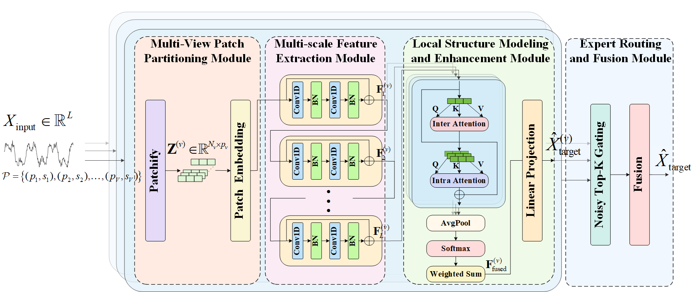

# M2MoE: A Multi-view Multi-scale Mixture-of-Experts Model for Time Series Forecasting


## Overview
Time series often exhibit multi-scale dynamic patterns and structural variations, which impose higher demands on the representation and adaptability of forecasting models. To address this challenge, we propose a Multi-view Multi-scale Mixture-of-Experts model (M2MoE) designed for fine-grained modeling and accurate prediction of complex temporal structures. Specifically, M2MoE partitions the input sequence into multiple views using various combinations of patch lengths and strides, with each view corresponding to a dedicated sub-model for extracting dynamic features at different granularities. Each sub-model is equipped with a multi-layer convolutional architecture and a dual attention mechanism to capture both local and global dependencies within and across temporal patches. Finally, a sparse gating mechanism is employed to adaptively select the most relevant experts for prediction based on the input characteristics. The experimental results demonstrate that M2MoE significantly outperforms existing methods on multiple public time series datasets, exhibiting superior accuracy and robustness.

<p align="center">
    
</p>

## Prerequisites
To get started, ensure you are using Python 3.10. Install the necessary dependencies by running:

```bash
pip install -r requirements.txt
```

## Data Preparation
Download the required datasets from [Autoformer](https://github.com/thuml/Autoformer) and [iTransfomer](https://github.com/thuml/iTransformer). Organize the data in a folder named `./data` as follows:

```
data
├── electricity.csv
├── ETTh1.csv
├── ETTh2.csv
├── ETTm1.csv
├── ETTm2.csv
├── traffic.csv
└── weather.csv
```

## Training Example
All training scripts are located in the `./scripts` directory. The details of the hyper-parameter settings are in Appendix C.4 in our paper. To train a model using the `weather` dataset, run the following command:

```bash
./scripts/Weather.sh
```


## Acknowledgements
We gratefully acknowledge the following GitHub repositories for their valuable contributions:

- [Autoformer](https://github.com/thuml/Autoformer)
- [DLinear](https://github.com/cure-lab/LTSF-Linear)
- [Time-Series-Library](https://github.com/thuml/Time-Series-Library)
- [PatchTST](https://github.com/yuqinie98/PatchTST)
- [iTransformer](https://github.com/thuml/iTransformer)


